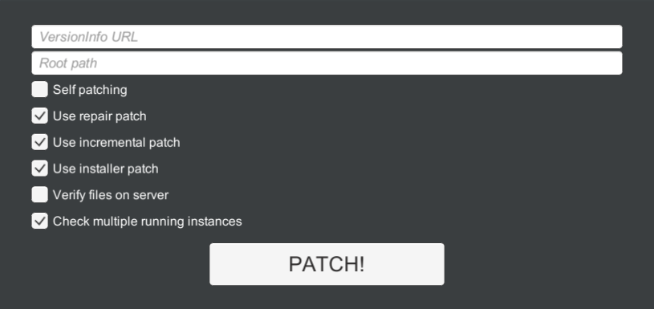
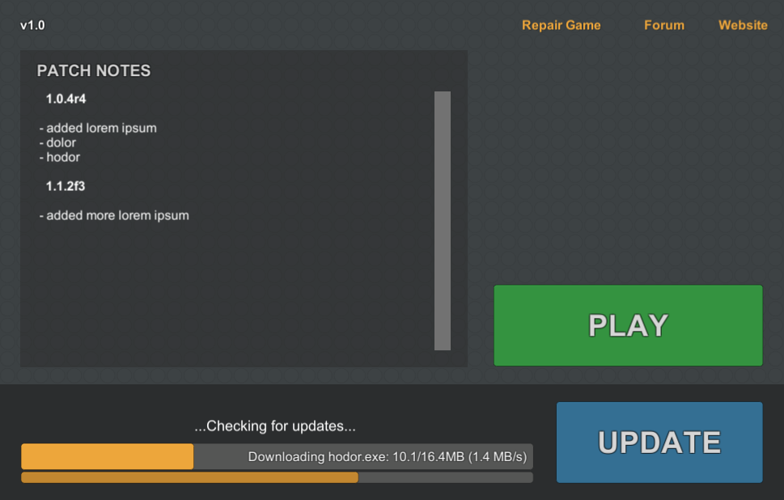

# Simple Patch Tool for Unity

**Available on Asset Store:** https://www.assetstore.unity3d.com/en/#!/content/124296

**Forum Thread:** https://forum.unity.com/threads/simplepatchtool-open-source-patching-solution-for-standalone-platforms.542465/

This plugin is a Unity port of the [SimplePatchTool library](https://github.com/yasirkula/SimplePatchTool), a general-purpose patcher library for **standalone** applications. Before using this plugin, you are recommended to first see SimplePatchTool's documentation: https://github.com/yasirkula/SimplePatchTool

## LICENSE

SimplePatchTool is licensed under the [MIT License](LICENSE); however, it uses external libraries that are governed by the licenses indicated below:

- LZMA SDK - [Public Domain](https://www.7-zip.org/sdk.html)
- Octodiff - [Apache License, Version 2.0](https://github.com/OctopusDeploy/Octodiff/blob/master/LICENSE.txt)
- SharpZipLib - [MIT License](https://github.com/icsharpcode/SharpZipLib/blob/master/LICENSE.txt)

## HOW TO

- import **SimplePatchTool.unitypackage** to your project
- in **Edit-Project Settings-Player**, change **Api Compatibility Level** to **.NET 2.0** or higher (i.e. don't use *.NET 2.0 Subset*)
- *(optional)* in **Edit-Project Settings-Player**, enable **Run In Background** so that SimplePatchTool can continue running while the application is minimized/not focused
- you can now use **Window-Simple Patch Tool** to [create/update patches, sign/verify xml files and generate RSA key pair](https://github.com/yasirkula/SimplePatchTool/wiki):


### Updating Dll's

This plugin uses SimplePatchTool's **SimplePatchToolCore** and **SimplePatchToolSecurity** modules without any modifications; so, if you want, you can make any changes to [these modules](https://github.com/yasirkula/SimplePatchTool), rebuild them and replace the dll files at *Plugins/SimplePatchTool/DLL* with their updated versions.

### Unity-specific Changes

To avoid any *Mono* related issues while applying patches in Unity, you should make the following changes to *SimplePatchTool* in your codes:

```csharp
SimplePatchTool patcher = new SimplePatchTool( ... )
// default IDownloadHandler implementation doesn't support https in Unity
.UseCustomDownloadHandler( () => new CookieAwareWebClient() )
// default implementation (DriveInfo.AvailableFreeSpace) throws NotImplementedException in Unity 5.6.2,
// so skip this stage until a Unity-compatible solution is found
.UseCustomFreeSpaceCalculator( ( drive ) => long.MaxValue );
```

Alternatively, you can call the [SPTUtils.CreatePatcher( string rootPath, string versionInfoURL )](Plugins/SimplePatchTool/Scripts/SPTUtils.cs) function which returns a Unity-compatible *SimplePatchTool* instance.

### About Self Patcher Executable

SimplePatchTool comes bundled with a self patcher executable on Windows platform. To add self patching support to macOS and/or Linux platforms, or to use a custom self patcher executable in your projects, you need to follow these steps:

- [build the self patcher executable](https://github.com/yasirkula/SimplePatchTool/wiki/Creating-Self-Patcher-Executable)
- move the self patcher executable and any of its dependencies to the following directory:
  - **Windows:** Plugins/SimplePatchTool/Editor/Windows
  - **macOS:** Plugins/SimplePatchTool/Editor/OSX
  - **Linux:** Plugins/SimplePatchTool/Editor/Linux
    - these files will [automatically be copied](Plugins/SimplePatchTool/Editor/PatcherPostProcessBuild.cs) to a subdirectory called [SPPatcher](https://github.com/yasirkula/SimplePatchTool/blob/master/SimplePatchToolCore/Utilities/PatchParameters.cs) after building the project to standalone (if you want, you can set **PatcherPostProcessBuild.ENABLED** to *false* to disable this feature)
- update the name of the self patcher executable in [SPTUtils.SelfPatcherExecutablePath](Plugins/SimplePatchTool/Scripts/SPTUtils.cs) property
- you can now run the self patcher like this: `patcher.ApplySelfPatch( SPTUtils.SelfPatcherExecutablePath );`
- or like this, if you want to automatically restart the game/launcher after self patching is completed: `patcher.ApplySelfPatch( SPTUtils.SelfPatcherExecutablePath, PatchUtils.GetCurrentExecutablePath() );`

## EXAMPLES

Some of the example scenes use the [PatcherUI](Plugins/SimplePatchTool/Demo/PatcherUI.cs) prefab to show *SimplePatchTool*'s progress to the user; feel free to use it in your own projects, as well:


If you [sign your *VersionInfo* and/or *PatchInfo* files with private RSA key(s)](https://github.com/yasirkula/SimplePatchTool/wiki/Signing-&-Verifying-Patches), you can paste their corresponding public RSA key(s) to the **Version Info RSA** and/or **Patch Info RSA** variables in the demo scenes.

If you plan to add self patching support to your app or test a demo scene that makes use of self patching, make sure that [your target platform's self patcher executable is set up](#about-self-patcher-executable).

### [PatcherControlPanelDemo](Plugins/SimplePatchTool/Demo/PatcherControlPanelDemo.cs)



This scene lets you tweak some variables at runtime to quickly test some patches with different configurations. It can run on the Editor.

### [SelfPatchingAppDemo](Plugins/SimplePatchTool/Demo/SelfPatchingAppDemo.cs)


**Video tutorial:** https://www.youtube.com/watch?v=Gjl6my7rVSI

This scene allows you to quickly create and test a self patching app. It can't run on the Editor.

You can test this scene as following:

- follow [these steps](https://github.com/yasirkula/SimplePatchTool/wiki/Generating-versionInfoURL) and paste VersionInfo's url to the **Version Info URL** variable of *SelfPatchingAppUI* in the Inspector
- tweak the value of **Check Version Only** as you like
- build this scene to an empty directory (let's say *SelfPatcherBuild*)
- [create a patch using the *SelfPatcherBuild* directory as *Root path*](https://github.com/yasirkula/SimplePatchTool/wiki/Creating-Patches#via-unity-plugin) (don't forget to complete the [After Creating a New Patch](https://github.com/yasirkula/SimplePatchTool/wiki/Creating-Patches#after-creating-a-new-patch) part, as well)
- if you had previously set *Check Version Only* to *false*, try deleting a redundant file from *SelfPatcherBuild* (e.g. something from the *Mono/etc* subdirectory). When you launch the app, it will automatically detect this change and prompt you to update/repair itself
- now, make some changes in the scene in Unity (e.g. add some cubes that are visible to the camera) and build it to another empty directory (let's say *SelfPatcherBuild2*)
- [create a patch using *SelfPatcherBuild2* as *Root path* and *SelfPatcherBuild* as *Previous version path* while also increasing the *Project version*](https://github.com/yasirkula/SimplePatchTool/wiki/Creating-Patches#via-unity-plugin)
- if you get an error message like `ERROR: directory ... is not empty` while creating the patch, make sure to point *Output path* to an empty directory
- if you launch the app, you'll see that it'll detect the update and prompt you to update itself to the latest version

### [LauncherDemo](Plugins/SimplePatchTool/Demo/LauncherDemo.cs)



This scene allows you to quickly create and test a launcher that can self patch itself in addition to patching and launching a main app. Launcher first checks if it is up-to-date (if not, self patches itself) and then checks if the main app is up-to-date (if not, patches it). If you don't provide a VersionInfo url for one of these patches, that patch will be skipped. This scene can't run on the Editor.

You can test this scene as following:

- [read these instructions](https://github.com/yasirkula/SimplePatchTool/wiki/Recommended-Project-Structure)
- [create VersionInfo'es](https://github.com/yasirkula/SimplePatchTool/wiki/Generating-versionInfoURL) for the launcher and the main app and paste their VersionInfo urls to the **Launcher Version Info URL** and **Main App Version Info URL** variables of *LauncherUI* in the Inspector
- decide a **Main App Subdirectory** (let's say *MainAppBuild*) and **Main App Executable** (let's say *MainApp.exe*)
- build this scene to an empty directory (let's say *LauncherBuild*)
- inside *LauncherBuild*, create an empty directory named *MainAppBuild*
- build another scene/project to *MainAppBuild* (this one will act as the main app)(the executable should be named as *MainApp.exe*)
- [create a patch for the launcher using *LauncherBuild* directory as *Root path* while adding `MainAppBuild/` to the *Ignored paths*](https://github.com/yasirkula/SimplePatchTool/wiki/Creating-Patches#via-unity-plugin) (complete the [After Creating a New Patch](https://github.com/yasirkula/SimplePatchTool/wiki/Creating-Patches#after-creating-a-new-patch) part, as well)
- create a patch for the main app using *MainAppBuild* as *Root path*
- try deleting a redundant file from *LauncherBuild* (e.g. something from the *Mono/etc* subdirectory). When you launch the launcher, it will automatically detect this change and prompt you to update/repair itself
- also try creating newer versions of the launcher and/or the main app (see [SelfPatchingAppDemo](#selfpatchingappdemo) for reference) and verify that the old launcher patches itself and/or the main app to the newest version(s)
